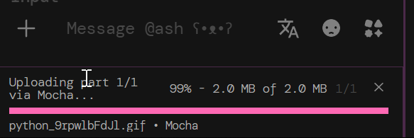
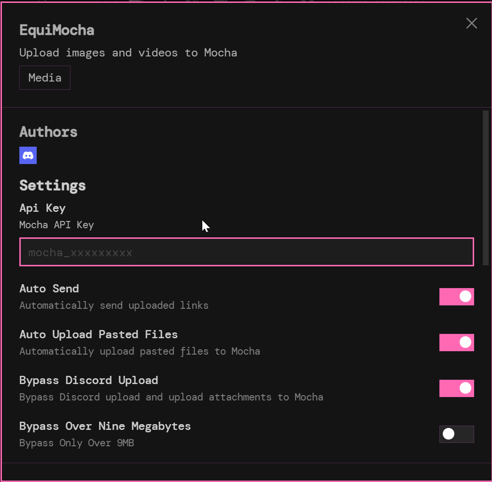
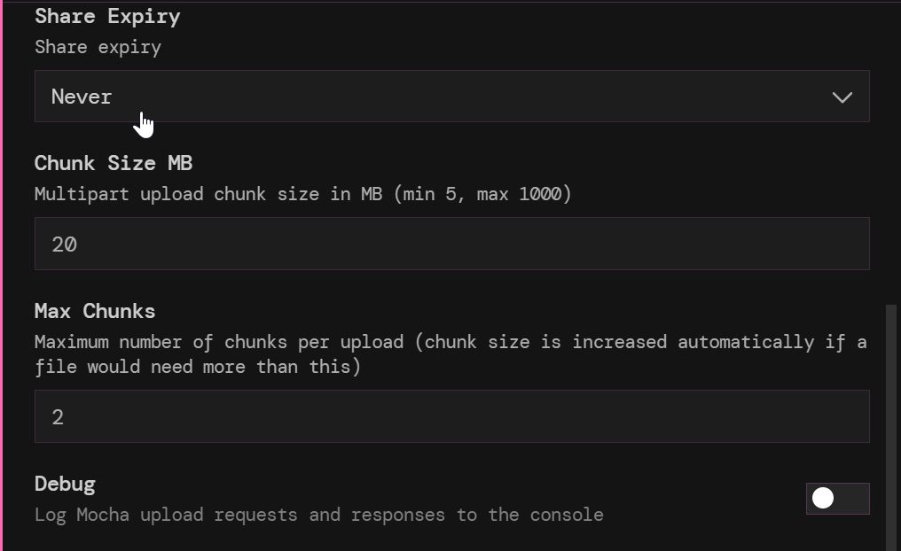
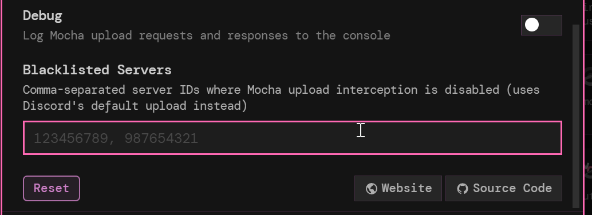

```
███████  ██████  ██    ██ ██ ███    ███  ██████   ██████ ██   ██  █████  
██      ██    ██ ██    ██ ██ ████  ████ ██    ██ ██      ██   ██ ██   ██ 
█████   ██    ██ ██    ██ ██ ██ ████ ██ ██    ██ ██      ███████ ███████ 
██      ██ ▄▄ ██ ██    ██ ██ ██  ██  ██ ██    ██ ██      ██   ██ ██   ██ 
███████  ██████   ██████  ██ ██      ██  ██████   ██████ ██   ██ ██   ██
```

<p align="center">
  
</p>

# INSTRUCTIONS (PLEASE READ)
Requirements:
- [NodeJS 18 or higher](https://nodejs.org/en/download)
- [Git](https://git-scm.com/downloads)

## NOTES BEFORE INSTALLATION
If you have installed Equicord before via the GUI you must first unpatch via the GUI before attempting to install via this method. If you have not installed Equicord before, you can skip this step.

Okay this is a different type of install.
1. Clone the Equicord repo `git clone https://github.com/Equicord/Equicord`

	You **HAVE TO CLONE THIS REPO**, it cannot build without the .git
2. Navigate to /Equicord/src/plugins and clone EquiMocha `git clone https://github.com/nxllvxxd/EquiMocha` 

	You can also download the zip and extract it, but I recommend using git for easier updates
3. Be sure you have pnpm installed, if not install with `npm i -g pnpm`
4. Navigate to the top of your Equicord folder
5. Run `pnpm install --frozen-lockfile`
6. Run `pnpm build`
7. Run `pnpm inject`
8. Follow the installation prompts
9. Restart Discord and the plugin should be under your plugins list in the settings menu

## Updating
1. Navigate to /Equicord/src/plugins/EquiMocha
2. Run `git pull` to update the plugin
3. Run `pnpm build` from Equicord root to rebuild the plugin
4. Run `pnpm inject` to inject the plugin into Discord

## NOTE
If the cancel button (which is just an X) is not visible, edit your custom theme with this css block:
```css
/* EquiMocha cancel button fix */
.vc-file-upload-progress-cancel {
    color: oklch(85% 0 0) !important;
    background: none !important;
    opacity: 0.7 !important;
}

.vc-file-upload-progress-cancel:hover {
    opacity: 1 !important;
}
```

## The Basics
- Autotriggers on files, either selected or dropped in that are larger than 9MB if the option is enabled
- Upload other shared files/videos/images to Mocha that are sent by other users in chat by right clicking the file and selecting "Upload to Mocha"
- Upload to Mocha by right clicking the plus sign in the Discord client and selecting "Upload to Mocha"
- Uploads to a folder named Discord in your Mocha root, then separated in folders by date within
- Shows progress of upload in the Discord client
- Auto sends the link once upload is complete
- If files land under the standard max for Discord without Nitro it will just upload through Discord unless you have the option to force upload to Mocha enabled
- Can be disabled for certain servers via the settings menu

<p align="center">
  
</p>
<p align="center">
  
</p>
<p align="center">
  
</p>